二叉树类型为常考题型	
1. 结合其他队列，栈，链表，字符等数据结构	
2. 基本遍历方式	
3. 递归函数的应用	
4. 其他实际工作	
需要熟练掌握二叉树各种遍历方式和各种改写能力，对递归的掌握游刃有余！！！

二叉树的遍历方法，[牛客网站](https://www.nowcoder.com/study/vod/1/7/1)
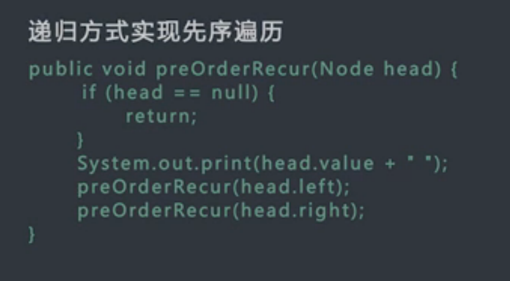

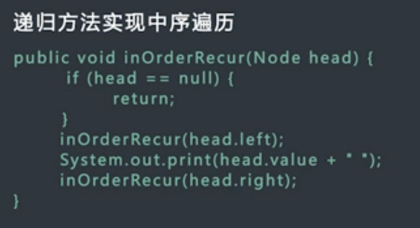
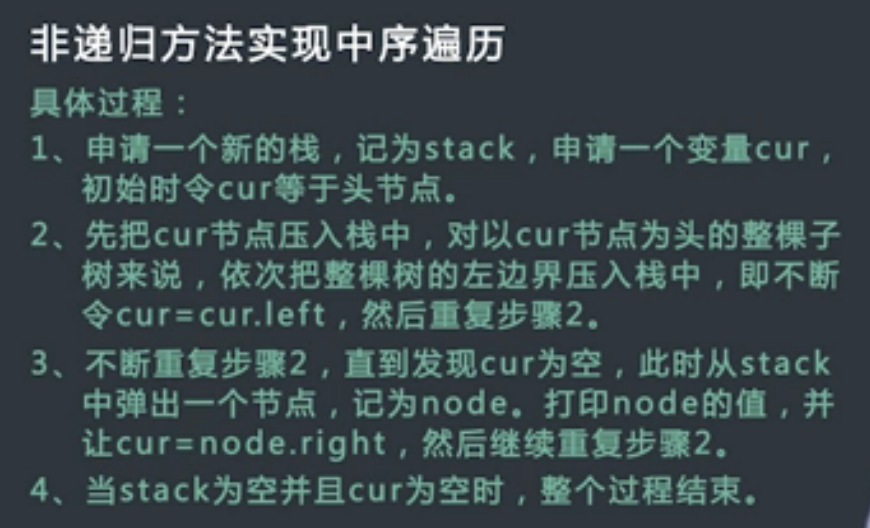
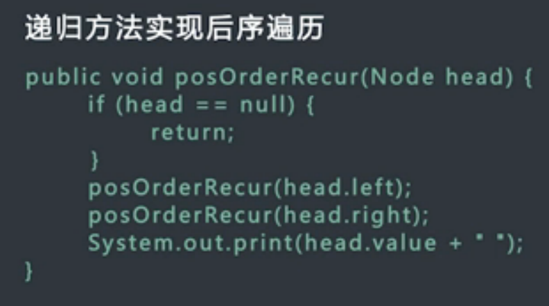
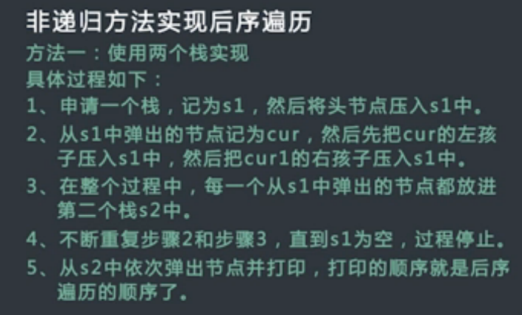
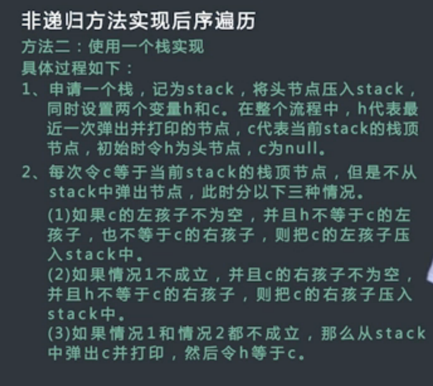

二叉树的按层遍历，按层打印

二叉树的序列化，反序列化

二叉树的类型  
    平衡二叉树(AVL树)     
    搜索二叉树   注意判断的代码 [lc98](https://leetcode.com/problems/validate-binary-search-tree/#/description)
    完全二叉树   判断方法        
    满二叉树    N = 2^L - 1 
    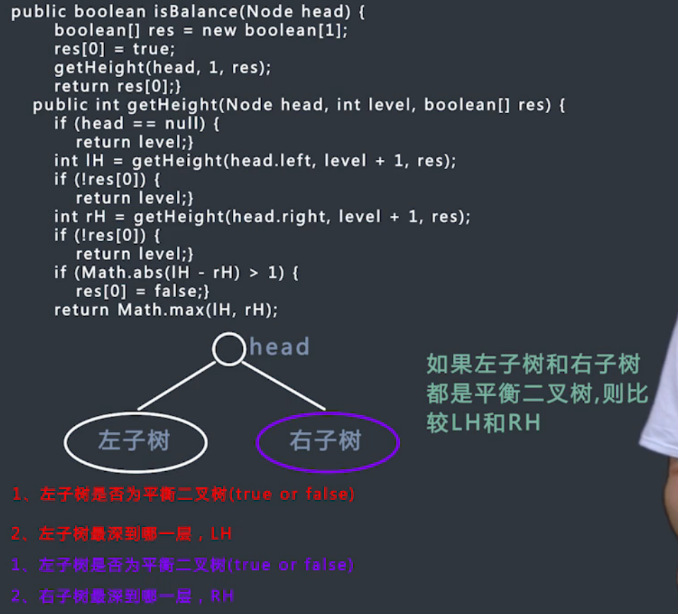
    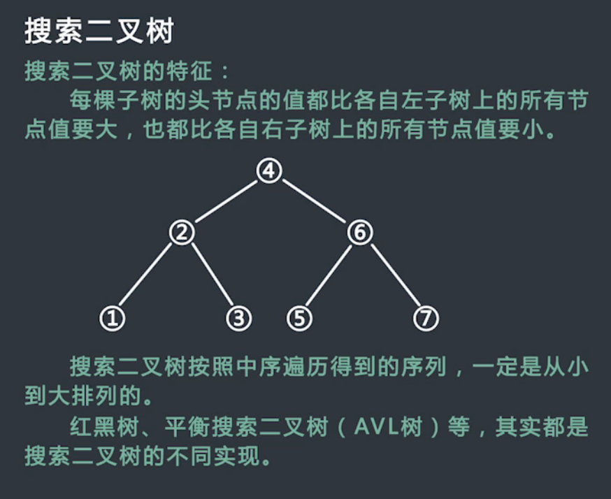
    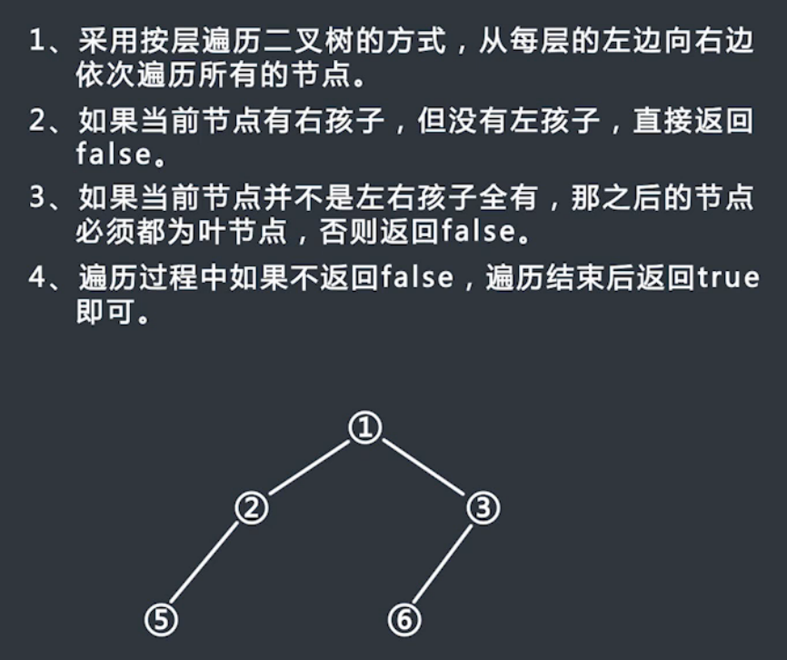
    
折纸问题  7-11
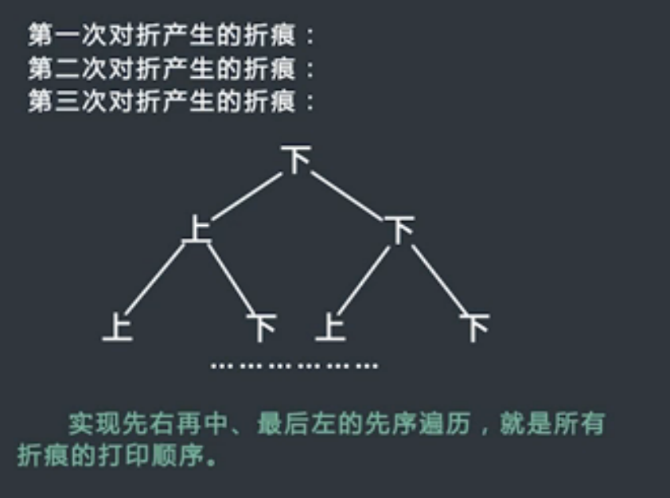

寻找错误节点 7-12

求节点间的最大距离 7-13
[比较复杂，可以查看视频理解](https://www.nowcoder.com/study/vod/1/7/10)
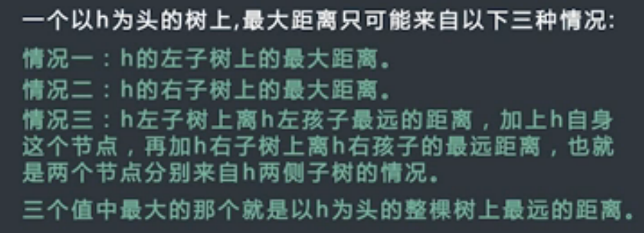
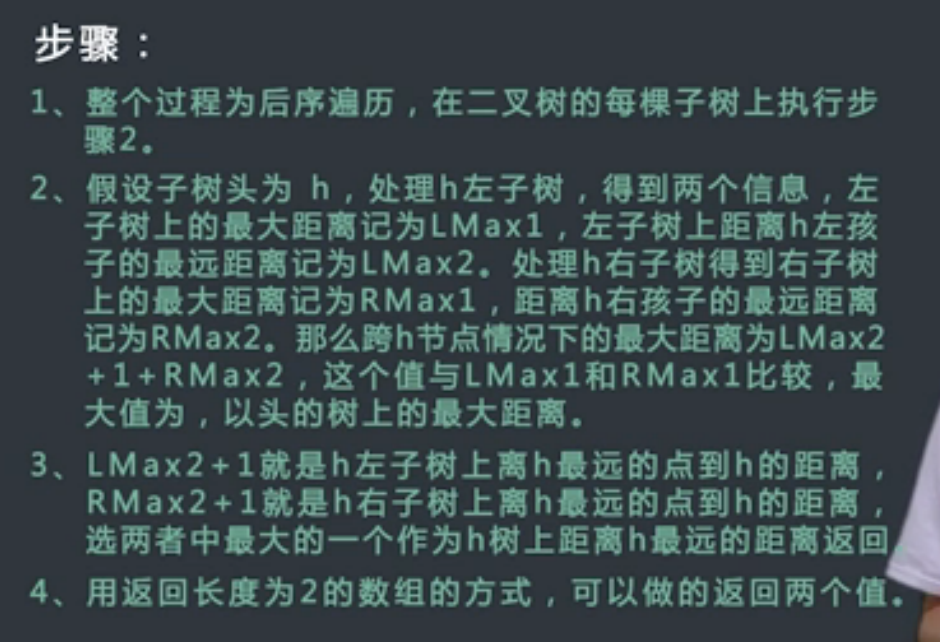

二叉搜索树的最大子树 7-14
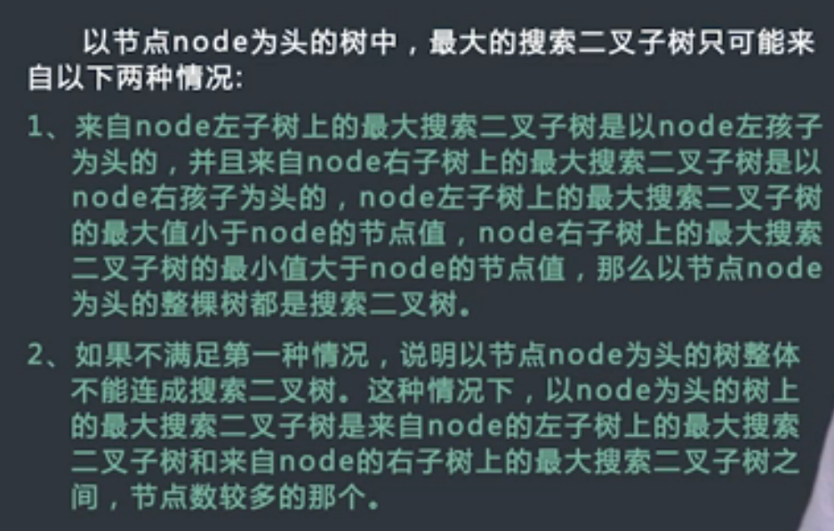
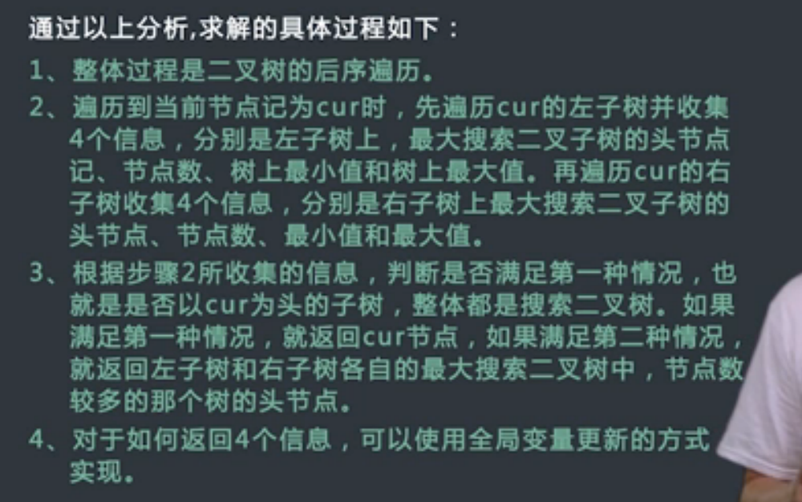