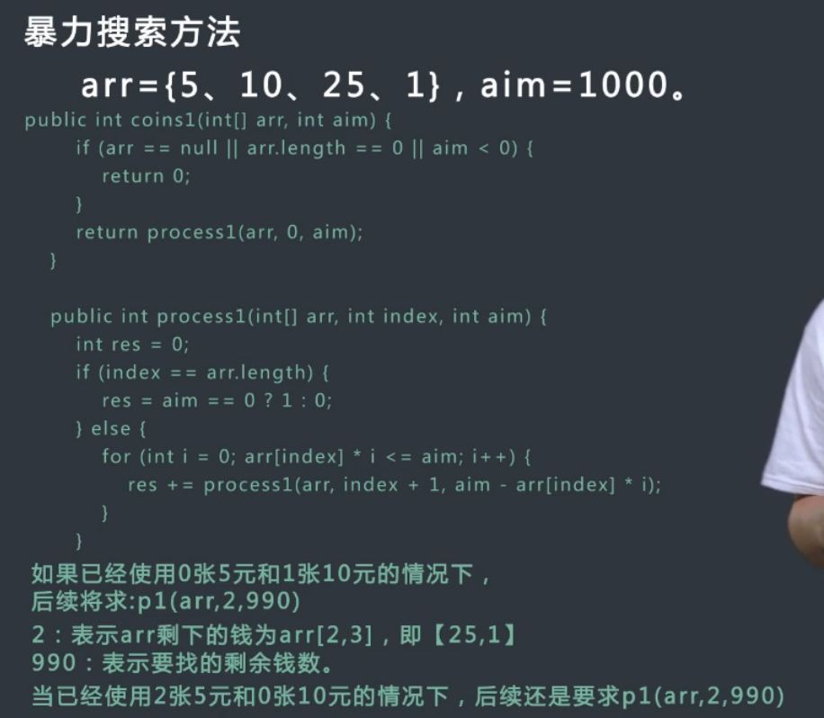
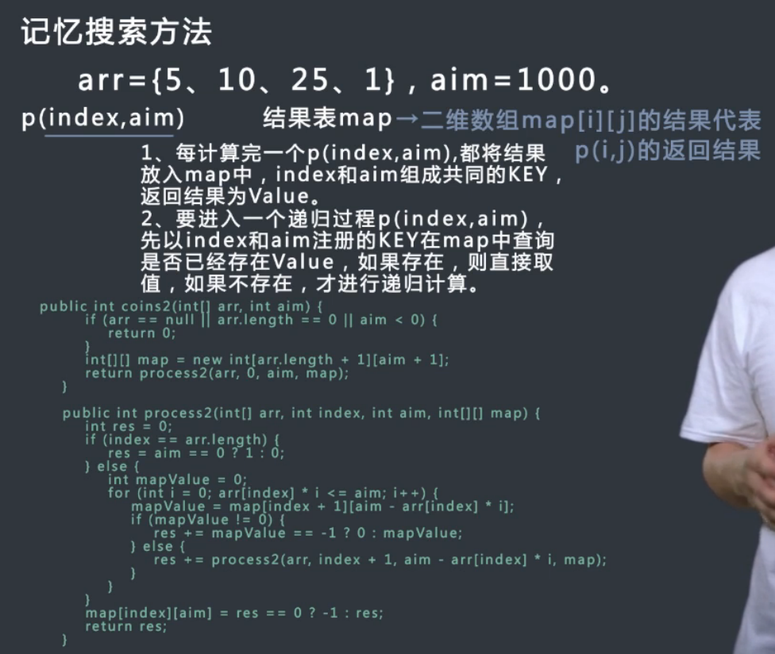
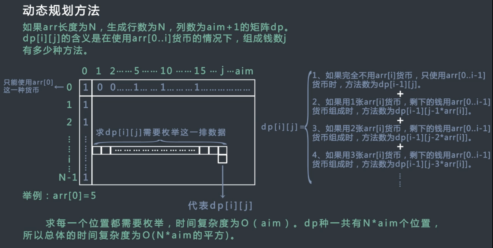
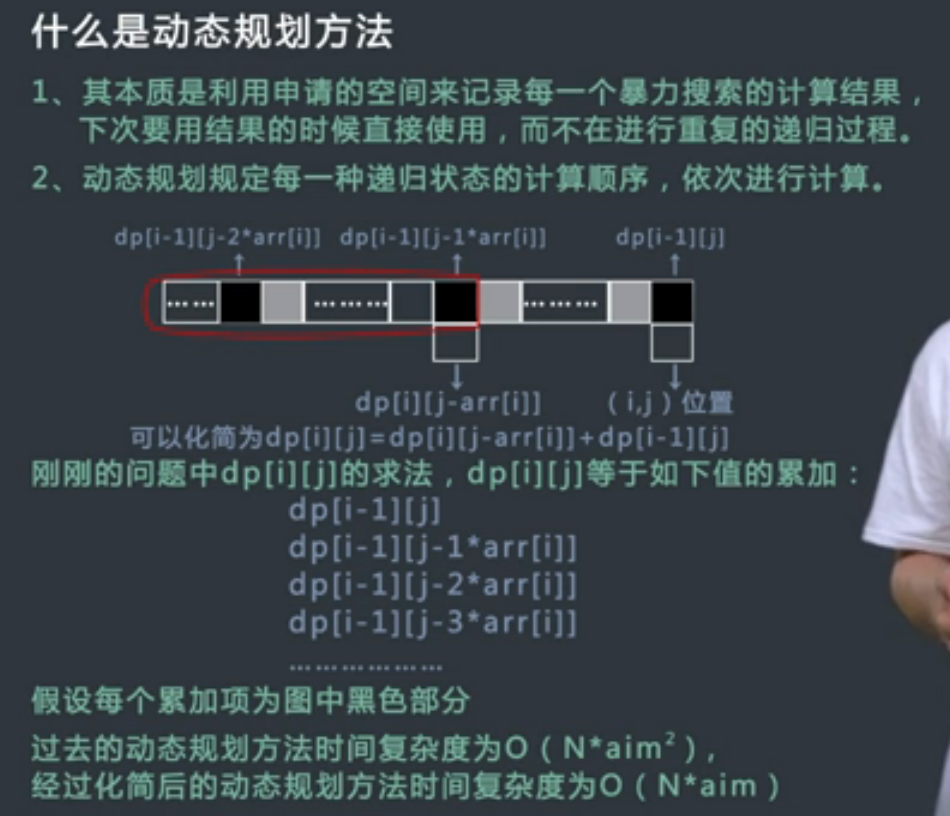
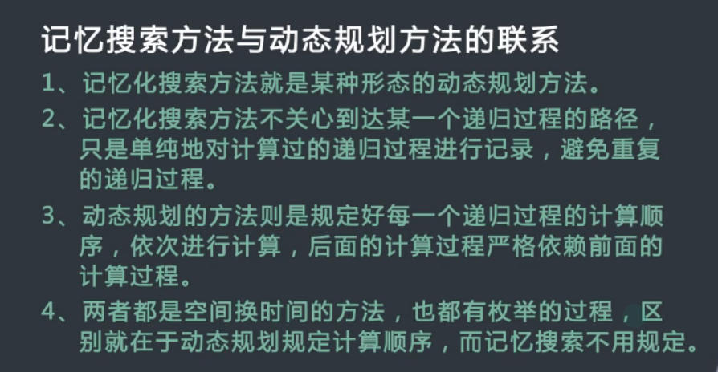
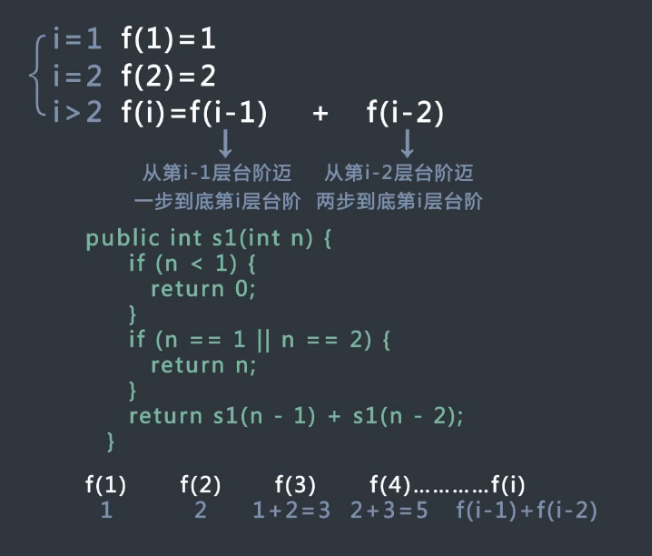
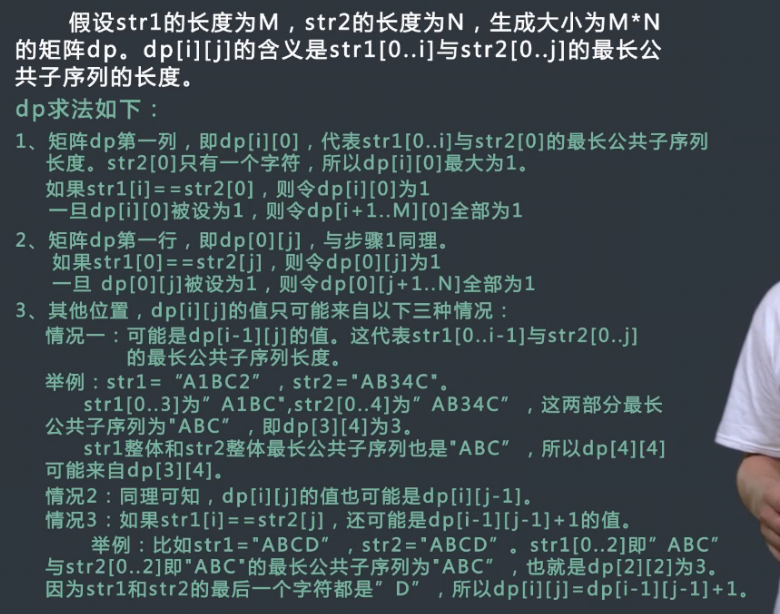
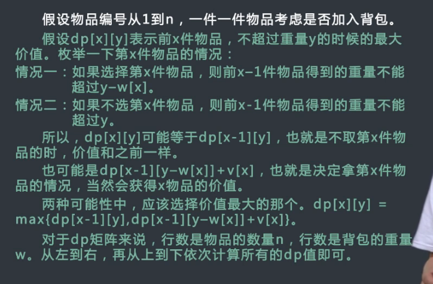

给定数组arr, arr中所有的值为正数且不重复。
每个值代表一种货币，每种面值的货币可以使用任意张。
在给定一个正数aim代表要找的钱数，求换钱有多少种方法。

暴力搜索方法
    |
记忆搜索方法
    |
动态规划方法
    |
动态规划的后续简化方法

可以参考[背包问题九讲](http://love-oriented.com/pack/)，思考动态规划问题的方法。

动态规划的本质		
是利用申请的空间来记录每一个暴力搜索的计算结果。
下一次要用结果的时候直接使用，而不再重复计算递归过程。
动态规划规定每一种递归状态的计算顺序，依次进行计算。

动态规划的大致过程       
1. 实现暴力搜索的方法    
2. 找到哪些参数可以代表递归过程。
3. 找到代表递归参数的过程，记忆化搜索的方法非常容易实现。
4. 通过分析记忆化搜索的依赖路径，进而实现动态规划。
5. 根据记忆化搜索方法改出的动态规划方法，进而看看是否能简化，
如果能简化，还能实现时间复杂度更低的动态规划方法。

动态规划方法的关键点      
1.最优化原理，也就是最优子结构性质，这指的是一个最优化策略具有这样的性质。
不论过去状态和策略如何，对前面的策略所形成的状态而言，余下的诸策略必须构成最优策略。
简单来说就是一个最优化策略的子策略总是最优的。
2. 无后效性。某状态下策略的收益，只与状态和策略相关，与如何到达该状态的方式无关。
3. 子问题的重叠性，动态规划将原来具有指数级别时间复杂度的暴力搜索算法改成了具有多项式时间组大度。
其中关键在于解决冗余，这是动态规划方法的本质。

【1】一个台阶总共有n 级，如果一次可以跳1 级，
也可以跳2 级。求总共有多少总跳法，并分析算法的时间复杂度。
   
   
【2】给定一个矩阵，从左上角开始每次只能向右或者向下移动，
最后到达右下角的位置，路径上的所有的数字累加起来作为这条路径的路劲和。
要求返回所有路径和中的最小路径和。   
   举例：
    1   3   5   9
    8   1   3   4
    5   0   6   1
    8   8   4   0
   路径1,3,1,0,6,1,0是所有路径中路径和最小的，所以返回其和12。

dp[i][j] = m[i][j] + min(dp[i-1][j], dp[i][j-1])

【3】给定数组arr，返回arr的最长递增子序列长度。
返回arr的最长递增子序列长度。
比如arr={2,1，5,3,6,4,8,9,7}，最长递增子序列为{1,3,4,8,9},
所以返回这个子序列的长度为5。 

dp[i] = max{dp[j] + 1  (0<=j<i, arr[j] < arr[i])}

【4】给定两个字符串str1和str2, 返回它们的最长公共子序列.
例如str1 = "1A2C3D4B56" 和 str2 = "B1D23CA45B6A", 
"123456"和"12C4B6"都是最长公共子序列，返回哪一个都可以。

【5】一个背包有一定的承重W, 有N件物品，每件都有自己的价值，记录在数组v中，
也都有自己的重量，记录在数组w中。每件物品只能选择装入背包还是不装入背包，
要求在不超过背包承重的情况下，选出物品总价值最大。

【6】给定两个字符串str1,长度为n和str2，长度为m，
再给定三个整数ic，dc，rc，分别代表插入，删除和替换一个字符的代价。
返回将str1编辑成str2的最小代价。

比如：str1=“abc”，str2=“adc”，ic=5，dc=3，rc=2，
从“abc”编辑成“adc”，把‘b’替换成‘d’的代价是最小的，所以返回2。
再比如rc=100的话，先删除‘b’，然后插入‘d’是代价最小的，所以返回8。

